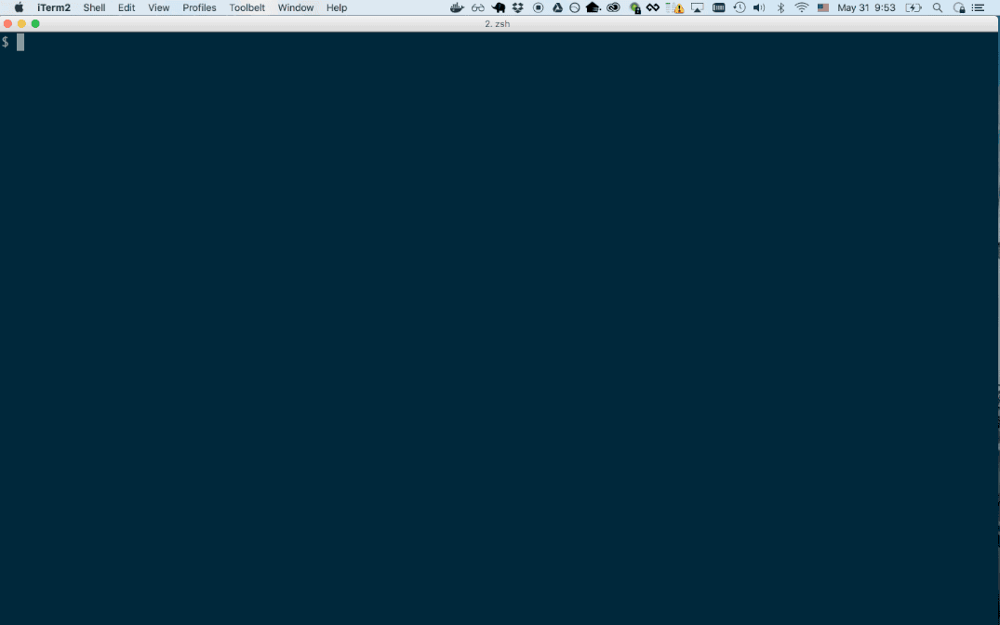

# DESPITE

Despite the pressure, self-doubt, hysteria, and rampant speculation that surrounds operational emergencies, we still need dependable tools to help us probe-sense-respond.

The first set of commands are some useful DB diagnostics ported from the
heroku pg-extras project. Unlike pg-extras, this command will connect to any
PG database, not just ones running on heroku. There are absolutely minimal
binary dependencies, not even libpq.

## Installation

On OSX, you can use homebrew

    brew tap kindlyops/tap
    brew install despite

On linux laptops, you can use linuxbrew

    brew tap kindlyops/tap
    brew install despite

In server environments, you can copy the raw binary or use docker

    docker pull kindlyops/despite

## building

This application is compiled inside a Docker container that has the go
toolchain installed. Using a build container guarantees that we are all using
the same toolchain to compile, and using the [gb](https://getgb.io/) build tool
ensures that we have reproducible builds without import rewriting, depending
on github uptime during compile, or setting up environment variables for paths.

To check and see if you have docker available and set up

    docker -v
    docker-compose -v
    docker info

If you don't have docker running, use the instructions at https://www.docker.com.
At the time of writing, this is working fine with docker 1.11.1-beta13.1.
Once you have docker set up:

    make        # show the available make targets
    make build  # compile, using docker build container
    make test   # run tests (provisions postgres inside docker)

This shows what it looks like when you successfully run the tests.

## Contributing

We have a list of issues that outline changes, features, or experiments
that we want to do, and are starting to set up a help-wanted label.
Feel free to open a pull request to discuss a proposed change.
